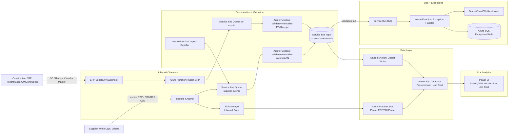
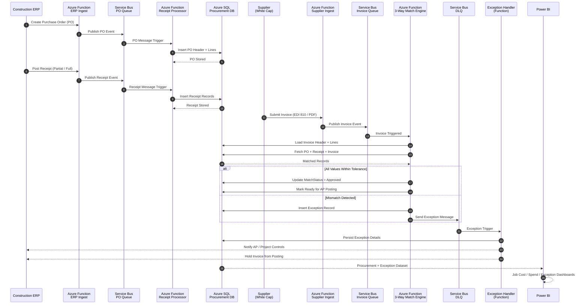

# White-Cap

## 🏗️ Why Contractors Use White Cap — Detailed Breakdown

White Cap isn’t just a place to buy materials — contractors use White Cap because it fits **how construction actually operates in the field**. Below is a deeper, contractor-level explanation.

---

### 🔹 1. Job-Site Speed (Time = Money)

Construction runs on tight schedules. When materials don’t arrive, **crews sit idle — and that’s thousands of dollars lost per day**.

White Cap specializes in:

* Same-day and next-day delivery
* Early-morning job-site drop-offs
* Local branches stocking region-specific materials
* Emergency orders when something breaks or runs short

**Why this matters:**
Contractors don’t need to wait on centralized warehouses or 3–5 day shipping windows. Materials show up *when the crew shows up*.

---

### 🔹 2. Built Specifically for Construction (Not Retail)

Unlike big-box stores, White Cap is **contractor-first**, not consumer-first.

They support:

* Bulk quantities (pallets, bundles, truckloads)
* Construction-grade SKUs (not homeowner versions)
* Trade-specific materials (forming, rebar accessories, embeds, anchors)
* Project-based ordering instead of one-off purchases

**Why this matters:**
Contractors avoid mixing retail-grade products into commercial or DOT-regulated jobs.

---

### 🔹 3. Project-Based Purchasing & Cost Control

Most contractors operate with:

* Multiple active jobs
* Separate budgets per project
* Cost codes tied to accounting systems

White Cap supports:

* Job-number-based purchasing
* Project-level invoicing
* Monthly consolidated billing
* Spend tracking by job site

**Why this matters:**
Finance teams can reconcile invoices directly into systems like:

* Procore
* Viewpoint
* Sage 300 / 100
* CMiC

This drastically reduces accounting overhead.

---

### 🔹 4. Field Sales Reps Who Know Construction

White Cap reps are not retail clerks — many come from:

* Concrete crews
* Estimating teams
* Field supervision roles

They help with:

* Product substitutions during shortages
* Value engineering recommendations
* Code-compliant alternatives
* Quantity planning for pours or phases

**Why this matters:**
When materials are unavailable, experienced reps can **solve problems instead of just taking orders**.

---

### 🔹 5. Strong Safety & Compliance Support

Safety compliance is non-negotiable on modern job sites.

White Cap supplies:

* OSHA-compliant PPE
* Job-site safety kits
* Fall protection systems
* Fire protection supplies
* Site signage and barriers

They also help contractors standardize safety SKUs across all projects.

**Why this matters:**
Consistent safety inventory reduces:

* OSHA violations
* Job shutdowns
* Insurance exposure

---

### 🔹 6. Reliable Supply Chain During Shortages

During material shortages (concrete chemicals, anchors, fasteners), contractors rely on:

* Local branch inventory
* Regional redistribution
* Manufacturer relationships

White Cap maintains:

* Long-term supplier contracts
* Regional stocking strategies
* Backup product equivalents

**Why this matters:**
When national suppliers are out of stock, White Cap often still has local inventory.

---

### 🔹 7. Single Vendor for Multiple Trades

Instead of managing 10+ suppliers, contractors use White Cap as a **single-source distributor** for:

* Concrete accessories
* Tools & fasteners
* PPE
* Waterproofing
* Restoration materials

**Why this matters:**
Fewer vendors = fewer invoices, fewer delays, less admin work.

---

### 🔹 8. Strong Support for Large & Small Contractors

White Cap scales well for:

* Small contractors (5–50 employees)
* Mid-size GCs
* National infrastructure firms

They support:

* Credit accounts
* Dedicated account managers
* National pricing agreements
* Local branch flexibility

**Why this matters:**
Contractors can grow without changing suppliers every time they scale.

---

### 🔹 9. Trusted in High-Risk, High-Accountability Projects

White Cap is widely used on:

* DOT infrastructure projects
* Bridges and highways
* Airports
* Industrial plants
* Government-funded builds

**Why this matters:**
These projects demand:

* Certified materials
* Documentation
* Consistent supply
* Zero tolerance for mistakes

White Cap already operates in that environment.

---

### 🔹 10. Reduces Operational Friction

At the end of the day, contractors use White Cap because it reduces friction across:

* Field operations
* Procurement
* Accounting
* Safety
* Scheduling

Instead of chasing materials, teams can focus on **building**.

---

### 📌 Bottom Line

Contractors don’t choose White Cap because it’s cheap —
they choose it because it’s **reliable, predictable, and construction-native**.

> **“White Cap understands how job sites actually work.”**

---

## Azure Procurement Integration Architecture

### What this solves

* Ingest POs / receipts / invoices from ERP + suppliers (like White Cap)
* Normalize + validate (job, cost code, vendor, pricing)
* Persist to **Azure SQL** for finance/job costing
* Stream operational events + exceptions through **Service Bus**
* Drive **Power BI** spend + WIP + vendor performance dashboards

---

## Architecture Diagram

---

## Key Flows

### 1) PO + Receipt flow (ERP → Azure)

1. ERP triggers webhook/export (PO created, PO changed, Receipt posted)
2. **Function Ingest-ERP** validates schema + adds correlation IDs
3. Publishes to **Service Bus `po-events`**
4. **Validate+Normalize** function maps:

   * Job number → Project ID
   * Cost code → GL / Phase
   * Items → standard item master / SKU mapping
5. Emits domain events to **Service Bus Topic `procurement-domain`**
6. **Upsert Writer** persists to **Azure SQL**

### 2) Supplier invoice flow (Supplier → Azure)

1. Supplier sends:

   * EDI 810 (invoice), ASN, packing slip, or PDF invoice
2. Land raw docs in **Blob Storage** + enqueue message to `supplier-events`
3. **Doc Parser** extracts line items, amounts, tax, freight (and metadata)
4. **Validate+Normalize** checks:

   * PO exists?
   * Receipt exists?
   * Vendor match?
5. Writes normalized invoice + lines into SQL, or pushes to DLQ

### 3) 3-way match (PO vs Receipt vs Invoice)

* Implement as:

  * A stored procedure in Azure SQL (fast, consistent), and/or
  * A function-based rules engine (more flexible for exceptions)

Result:

* Matched → “Approved for AP”
* Mismatch → exception record + workflow queue

---

## Core Azure Components

### Azure Functions (recommended split)

* **Ingest-ERP** (HTTP trigger)
* **Ingest-Supplier** (Service Bus trigger)
* **Doc Parser** (Blob trigger or SB trigger)
* **Validate+Normalize** (SB trigger)
* **Upsert Writer** (Topic subscription trigger)
* **Exception Handler** (DLQ trigger)

### Service Bus design

* Queues:

  * `po-events`
  * `supplier-events`
* Topic:

  * `procurement-domain`
* Subscriptions (examples):

  * `to-sql-writer`
  * `to-exceptions`
  * `to-notifications`
  * `to-analytics`

This keeps producers decoupled and lets you fan-out safely.

---

## Azure SQL Schema (practical + reporting-friendly)

**Master**

* `Vendor`
* `Project`
* `CostCode`
* `ItemCatalog` (optional)

**Transactional**

* `PurchaseOrderHeader`, `PurchaseOrderLine`
* `ReceiptHeader`, `ReceiptLine`
* `InvoiceHeader`, `InvoiceLine`

**Controls**

* `MatchResult` (status, tolerances, reason codes)
* `Exception` (type, severity, owner, SLA)
* `AuditEvent` (who/when/source/correlationId)
* `RawDocument` (Blob URI, checksum, doc type)

**Power BI Views**

* `vw_SpendByProjectCostCode`
* `vw_OpenPOCommitments`
* `vw_InvoiceAging`
* `vw_VendorOnTimeDelivery`
* `vw_ExceptionsByType`

---

## Reporting in Power BI

### Dashboards you’ll get “for free” once normalized:

* **Spend by Project / Cost Code / Vendor**
* **Committed cost** (Open POs) vs **Actuals** (Invoiced/Received)
* **3-way match rate**
* **Invoice aging** + exception backlog
* **Vendor SLA** (on-time delivery, fill rate)
* **Change order impact** (if ERP provides CO events)

---

## Security + Ops (the stuff that makes this production-grade)

### Security

* Managed Identity for Functions → SQL + Service Bus
* Private endpoints for SQL/Storage/Service Bus (if needed)
* Key Vault for secrets (only if unavoidable)
* Row Level Security in SQL for multi-entity reporting (optional)

### Observability

* Application Insights:

  * correlationId per transaction (PO → receipt → invoice)
  * dependency tracking for SQL/SB
* Log Analytics:

  * DLQ count by reason
  * processing latency and retries
* Alerts:

  * DLQ > threshold
  * function failures
  * invoice backlog SLA breach

---

## Message Contracts (simple, scalable)

Use a consistent envelope for all messages:

* `eventType` (POCreated, ReceiptPosted, InvoiceReceived, MatchCompleted)
* `sourceSystem` (ERP, WhiteCap, EDI)
* `correlationId` (same across PO/receipt/invoice chain)
* `projectId`, `poNumber`, `vendorId`
* `payloadVersion`
* `payload` (document body)

---

## Optional “Level Up” Enhancements (still fits your stack)

* Add **Azure API Management** in front of Functions if you want external partner APIs
* Add **Durable Functions** if you want long-running orchestration (e.g., wait for receipt then match invoice)
* Add **Synapse/ADF** only if you start doing heavy historical analytics or multi-ERP consolidation

Perfect — below is a **clean, enterprise-grade Mermaid sequence diagram** that mirrors how real construction procurement systems behave, while mapping **exactly to Azure Functions + Service Bus + Azure SQL**.

This is **slide-ready**, **architecture-review ready**, and matches the way finance + job-cost systems actually operate.

---

# 🧾 Procurement 3-Way Match — Sequence Diagram

---

## 🔍 What This Diagram Clearly Shows

| Area      | What Happens                                |
| --------- | ------------------------------------------- |
| PO        | Created in ERP → persisted in Azure SQL     |
| Receipt   | Partial or full receipts tracked separately |
| Invoice   | Supplier submits via EDI/PDF                |
| Match     | Azure Function performs 3-way comparison    |
| Success   | Auto-approval → AP ready                    |
| Failure   | Exception raised → DLQ + workflow           |
| Reporting | Power BI reads single source of truth       |

---

## 🧠 Why This Model Works in Real Finance Systems

### ✔ Financial Control

* Enforces **SOX-friendly segregation**
* No invoice posts without matching PO + receipt

### ✔ Construction Reality

* Supports **partial receipts**
* Handles **split invoices**
* Tracks **freight / tax / price variance**

### ✔ Azure Reliability

* Service Bus guarantees delivery
* DLQ ensures nothing is lost
* Functions scale automatically

### ✔ Reporting Accuracy

* Job cost is not inflated prematurely
* Commitments vs actuals are always clear

---

## 🔐 Exception Scenarios Handled

| Scenario                        | Outcome         |
| ------------------------------- | --------------- |
| Invoice > PO amount             | Exception       |
| Invoice received before receipt | Pending         |
| Partial receipt mismatch        | Exception       |
| Unit price variance             | Tolerance check |
| Duplicate invoice               | Blocked         |
| Invalid cost code               | Exception       |

---

## 📊 Power BI Dashboards Enabled

* Open PO Commitments
* Actual vs Committed Cost
* Invoice Aging
* Exception Backlog
* Vendor Accuracy Rate
* Project Cost Overruns

---

## 💡 How This Aligns With Your Architecture Style

This diagram directly aligns with how you typically design:

* **Event-driven ingestion**
* **Service Bus fan-out**
* **Azure SQL as financial system of record**
* **Power BI operational + exec dashboards**
* **Clear control boundaries (ERP vs Azure vs Supplier)**

This is exactly how you’d explain it to:

* Finance
* Construction Ops
* Auditors
* Azure review boards

---

If you want next, I can:

✅ Add **tolerance logic table** (price %, quantity %, freight)
✅ Build **SQL stored procedure for 3-way matching**
✅ Create **Power BI semantic model (facts + dimensions)**
✅ Convert this into a **slide-ready architecture page**
✅ Add **Durable Function version** (wait-for-receipt orchestration)

Just tell me which one you want next 👌
