# White-Cap


## 🏗️ Why Contractors Use White Cap — Detailed Breakdown

White Cap isn’t just a place to buy materials — contractors use White Cap because it fits **how construction actually operates in the field**. Below is a deeper, contractor-level explanation.

---

### 🔹 1. Job-Site Speed (Time = Money)

Construction runs on tight schedules. When materials don’t arrive, **crews sit idle — and that’s thousands of dollars lost per day**.

White Cap specializes in:

* Same-day and next-day delivery
* Early-morning job-site drop-offs
* Local branches stocking region-specific materials
* Emergency orders when something breaks or runs short

**Why this matters:**
Contractors don’t need to wait on centralized warehouses or 3–5 day shipping windows. Materials show up *when the crew shows up*.

---

### 🔹 2. Built Specifically for Construction (Not Retail)

Unlike big-box stores, White Cap is **contractor-first**, not consumer-first.

They support:

* Bulk quantities (pallets, bundles, truckloads)
* Construction-grade SKUs (not homeowner versions)
* Trade-specific materials (forming, rebar accessories, embeds, anchors)
* Project-based ordering instead of one-off purchases

**Why this matters:**
Contractors avoid mixing retail-grade products into commercial or DOT-regulated jobs.

---

### 🔹 3. Project-Based Purchasing & Cost Control

Most contractors operate with:

* Multiple active jobs
* Separate budgets per project
* Cost codes tied to accounting systems

White Cap supports:

* Job-number-based purchasing
* Project-level invoicing
* Monthly consolidated billing
* Spend tracking by job site

**Why this matters:**
Finance teams can reconcile invoices directly into systems like:

* Procore
* Viewpoint
* Sage 300 / 100
* CMiC


## 🏗️ White Cap — Enterprise Systems Architecture (Expanded View)

**White Cap** operates at massive scale — thousands of SKUs, hundreds of branches, same-day jobsite delivery, and tight supplier margins.
To support this, White Cap runs a **modern, enterprise-grade digital backbone** built specifically for **distribution velocity, financial control, and supplier reliability**.

Below is a deeper explanation of **why each system was chosen, what it controls, and how they work together**.

---

# 🧱 White Cap Enterprise Technology Stack

---

## 1️⃣ Financial ERP — Oracle E-Business Suite (EBS)

**Selected in 2021** to replace fragmented legacy financial systems.

### Why Oracle EBS

White Cap needed:

* High-volume transaction processing
* Strong internal controls
* Multi-branch accounting
* Robust audit and compliance support

Oracle EBS excels at:

* General Ledger (GL)
* Accounts Payable (AP)
* Accounts Receivable (AR)
* Fixed Assets
* Cost accounting
* Intercompany accounting

### What Oracle EBS controls

* Official books of record
* Supplier master data
* Payment execution (ACH / wire / checks)
* Revenue recognition
* Period close and reporting

### Why this matters

At White Cap’s scale:

* Millions of invoices annually
* Thin distribution margins
* Heavy audit and compliance requirements

Oracle provides:

* Strong segregation of duties
* Approval hierarchies
* Audit trails
* SOX-aligned controls

**Oracle EBS is the financial authority — nothing posts without it.**

---

## 2️⃣ Supply Chain Planning — GAINS Platform

White Cap uses **GAINS** for advanced supply chain forecasting and replenishment.

### Why GAINS

Construction supply demand is:

* Highly regional
* Seasonal
* Weather-dependent
* Project-driven (non-linear)

GAINS provides:

* AI/ML-based demand forecasting
* Branch-level inventory optimization
* Replenishment recommendations
* Safety stock optimization

### What GAINS manages

* SKU demand forecasting per branch
* Inventory turn optimization
* Reorder point calculations
* Stock-out prevention
* Excess inventory reduction

### Example

If rebar demand spikes in Texas but slows in Ohio:

* GAINS reallocates inventory strategies
* Prevents both shortages and overstock

### Why this matters

For distributors:

* Inventory = cash tied up
* Overstock kills margins
* Stock-outs kill customers

GAINS helps White Cap:

* Increase inventory turns
* Reduce working capital
* Maintain same-day fulfillment

---

## 3️⃣ Procurement Platform — Coupa

White Cap partners with **Coupa** for procurement and spend control.

### Why Coupa

White Cap buys from:

* Thousands of manufacturers
* Thousands of suppliers
* Across regions, branches, and categories

Coupa provides:

* Centralized procurement workflows
* Supplier onboarding
* Digital POs
* Invoice automation
* Spend analytics

### What Coupa controls

* Purchase requisitions
* PO approvals
* Supplier catalogs
* Invoicing intake
* 3-way match orchestration
* Supplier payments (pre-ERP)

### Coupa acts as the “front door” for spend

* Branches request purchases in Coupa
* Suppliers submit invoices through Coupa
* Coupa validates invoices before ERP posting

### Why this matters

Without Coupa:

* Procurement becomes fragmented
* Maverick spend increases
* Pricing contracts are bypassed
* Invoice errors multiply

Coupa enforces **procurement discipline at scale**.

---

## 4️⃣ How These Systems Work Together

### End-to-End Flow (Simplified)

```text
Demand → Planning → Procurement → Receiving → Invoicing → Payment → Analytics
```

| Stage                 | System     |
| --------------------- | ---------- |
| Demand forecast       | GAINS      |
| Replenishment signals | GAINS      |
| Purchase requisitions | Coupa      |
| PO creation           | Coupa      |
| Supplier invoicing    | Coupa      |
| 3-way match           | Coupa      |
| Financial posting     | Oracle EBS |
| Payment execution     | Oracle EBS |
| Financial reporting   | Oracle EBS |
| Spend analytics       | Coupa + BI |

Each system has **clear ownership boundaries**, which is critical at enterprise scale.

---

## 5️⃣ Why This Architecture Works for a Distributor Like White Cap

### ✔ Separation of concerns

* GAINS = *what to buy*
* Coupa = *how to buy*
* Oracle = *how to pay & report*

No system overlaps responsibilities unnecessarily.

---

### ✔ Scales across hundreds of branches

Each branch operates independently but reports centrally.

* Local demand
* Central procurement rules
* Corporate financial control

This balance is extremely difficult without this architecture.

---

### ✔ Strong supplier governance

* Contract pricing enforced in Coupa
* Approved suppliers only
* Invoice validation before payment
* Clean audit trails

---

### ✔ Finance-grade controls

* Oracle enforces accounting integrity
* Coupa enforces procurement compliance
* GAINS optimizes cash tied in inventory

This trio supports:

* SOX compliance
* External audits
* Internal controls
* Predictable cash flow

```mermaid
sequenceDiagram
  autonumber
  %% --- Actors / Systems ---
  participant PM as Branch / Buyer / Planner
  participant GAINS as GAINS (Demand Planning)
  participant COUPA as Coupa (Procure-to-Pay)
  participant SUP as Supplier / Manufacturer
  participant WMS as WMS (Warehouse Mgmt)
  participant TMS as TMS (Transportation / Delivery)
  participant CARR as Carrier / Fleet
  participant ORCL as Oracle E-Business Suite (Financial ERP)
  participant BI as Analytics (DWH/Power BI)

  %% =========================
  %% 1) Demand Planning & Replenishment
  %% =========================
  rect rgb(235, 245, 255)
    note over GAINS,WMS: 1) Demand Planning & Replenishment (Stocked Items)
    WMS-->>GAINS: Daily inventory, sales, transfers, stockouts
    GAINS-->>GAINS: Forecast demand by branch/SKU + seasonality/projects
    GAINS-->>PM: Replenishment recommendations (SKU/qty/branch/date)
    PM->>COUPA: Create requisition (auto or assisted) + cost center/branch
    COUPA-->>COUPA: Validate supplier, contract pricing, approvals, budget rules
    COUPA->>ORCL: Commit/encumber (optional) + vendor master/GL validation
    ORCL-->>COUPA: Approved accounting context (vendor, terms, GL segments)
    COUPA->>SUP: Issue Purchase Order (PO) (API/EDI/email)
    SUP-->>COUPA: PO Acknowledgement (confirm qty/dates or propose changes)
    COUPA-->>ORCL: PO summary / commitment update (status + expected receipt)
  end

  %% =========================
  %% 2) Inbound Logistics & Receiving
  %% =========================
  rect rgb(245, 255, 235)
    note over SUP,WMS: 2) Inbound Logistics & Receiving (ASN → Receipt)
    SUP-->>COUPA: ASN / Ship Notice (API/EDI) with cartons/pallets/tracking
    COUPA-->>WMS: Inbound expected receipt (items/qty/ETA/packing)
    CARR-->>TMS: Inbound shipment status updates (pickup/in-transit/arrival)
    TMS-->>WMS: Dock appointment / ETA adjustments (optional)
    WMS-->>WMS: Receive goods (scan/putaway/lot/serial if needed)
    WMS-->>COUPA: Receipt confirmation (GRN) + discrepancies/damages
    COUPA-->>ORCL: Receipt posted (for accruals / inventory valuation)
  end

  %% =========================
  %% 3) Invoice → 3-Way Match → Payment
  %% =========================
  rect rgb(255, 245, 235)
    note over COUPA,ORCL: 3) Invoice Processing (3-Way Match + Payment)
    SUP-->>COUPA: Invoice submitted (API/EDI/PDF ingest) + invoice number
    COUPA-->>COUPA: Validate duplicates, tax, terms, line integrity
    COUPA-->>COUPA: 3-way match (PO vs Receipt vs Invoice) + tolerances
    alt Matched (within tolerance)
      COUPA-->>ORCL: Post AP invoice (approved) + coding/segments
      ORCL-->>ORCL: AP invoice created + scheduled for payment run
      ORCL-->>SUP: Remittance / payment execution (ACH/wire/check)
      ORCL-->>COUPA: Payment status (paid/date/reference)
    else Exception (qty/price/tax mismatch)
      COUPA-->>PM: Exception workflow (review/resolve/approve/reject)
      PM-->>COUPA: Resolve (credit request / receipt correction / PO change)
      COUPA-->>COUPA: Re-run match after resolution
      COUPA-->>ORCL: Post AP invoice when approved
    end
  end

  %% =========================
  %% 4) Customer Order Fulfillment (Branch / Jobsite)
  %% =========================
  rect rgb(240, 240, 255)
    note over WMS,TMS: 4) Customer Fulfillment (Counter / Delivery / Jobsite)
    PM->>WMS: Create sales order / pick request (branch fulfillment)
    WMS-->>WMS: Allocate inventory + wave/pick/pack
    WMS->>TMS: Load planning + route optimization + delivery schedule
    TMS->>CARR: Dispatch delivery (company fleet or 3rd-party)
    CARR-->>TMS: Proof of delivery (POD) + exceptions (damaged/short)
    TMS-->>WMS: Delivery completion status
    WMS-->>ORCL: Sales shipment confirmation (COGS/inventory decrement)
    ORCL-->>ORCL: AR invoice generation (customer billing) + revenue posting
  end

  %% =========================
  %% 5) Analytics, Controls, and Feedback Loops
  %% =========================
  rect rgb(250, 250, 250)
    note over GAINS,BI: 5) Analytics & Feedback (Spend + Inventory + Service)
    COUPA-->>BI: Spend, exceptions, supplier performance (PO/Invoice cycle time)
    ORCL-->>BI: Financials (AP/AR/GL), aging, margins, close metrics
    WMS-->>BI: Inventory turns, fill rate, stockouts, OTIF
    TMS-->>BI: On-time delivery, route efficiency, cost per drop
    BI-->>GAINS: Demand signals + forecast accuracy feedback
  end
```




Below is a **clean, executive- and audit-ready table** that explains **each step in the White Cap end-to-end system sequence** — written so **finance, supply chain, IT, and auditors** can all read the same document and agree on it.

This maps directly to the diagram you requested.

---

# 🏗️ White Cap — End-to-End System Flow (Step Explanation Table)

| Step # | Phase                   | System(s) Involved    | What Happens                                                                  | Why It Matters                                                    |
| ------ | ----------------------- | --------------------- | ----------------------------------------------------------------------------- | ----------------------------------------------------------------- |
| 1      | Demand Capture          | WMS → GAINS           | Daily sales, inventory levels, transfers, and stockouts are sent to GAINS     | Provides real consumption data instead of guess-based forecasting |
| 2      | Demand Forecasting      | GAINS                 | AI/ML models forecast SKU demand by branch, seasonality, and project activity | Prevents overstock and stockouts                                  |
| 3      | Replenishment Planning  | GAINS                 | System generates recommended reorder quantities and timing                    | Optimizes working capital                                         |
| 4      | Requisition Creation    | GAINS → Coupa         | Approved replenishment plans generate purchase requisitions                   | Standardizes buying across branches                               |
| 5      | Procurement Controls    | Coupa                 | Pricing contracts, approved suppliers, and approval workflows enforced        | Eliminates maverick spend                                         |
| 6      | Accounting Validation   | Coupa → Oracle EBS    | Vendor, GL segments, and accounting rules validated                           | Prevents downstream posting errors                                |
| 7      | Purchase Order Issuance | Coupa → Supplier      | PO transmitted via API or EDI                                                 | Creates legally binding purchase commitment                       |
| 8      | PO Acknowledgement      | Supplier → Coupa      | Supplier confirms quantities, pricing, and delivery dates                     | Locks the PO baseline                                             |
| 9      | Commitment Update       | Coupa → Oracle EBS    | PO summary posted for financial commitments                                   | Enables accrual forecasting                                       |
| 10     | Advance Ship Notice     | Supplier → Coupa      | Supplier sends ASN with packing and shipment details                          | Enables proactive receiving                                       |
| 11     | Inbound Visibility      | Coupa → WMS / TMS     | Expected receipts and ETAs shared                                             | Improves dock and labor planning                                  |
| 12     | Goods Receipt           | WMS                   | Warehouse receives goods via scanning and inspection                          | Confirms physical receipt                                         |
| 13     | Receipt Posting         | WMS → Coupa           | Receipt quantities and discrepancies recorded                                 | Creates receiving evidence                                        |
| 14     | Financial Accrual       | Coupa → Oracle EBS    | Receipt posted for inventory valuation                                        | Accurate financial statements                                     |
| 15     | Invoice Submission      | Supplier → Coupa      | Supplier submits invoice electronically                                       | Eliminates paper invoices                                         |
| 16     | Invoice Validation      | Coupa                 | Duplicate checks, tax validation, line verification                           | Prevents payment errors                                           |
| 17     | 3-Way Match             | Coupa                 | Invoice compared against PO and receipt                                       | Core financial control                                            |
| 18     | Match Approved          | Coupa → Oracle EBS    | Clean invoices posted to AP                                                   | Auto-approval reduces AP workload                                 |
| 19     | Exception Routing       | Coupa                 | Mismatches routed for review                                                  | Controlled human intervention                                     |
| 20     | Exception Resolution    | Buyer / AP            | PO correction, receipt update, or credit memo                                 | Maintains audit integrity                                         |
| 21     | AP Posting              | Oracle EBS            | Approved invoice recorded in AP                                               | System of record updated                                          |
| 22     | Payment Processing      | Oracle EBS            | ACH, wire, or check issued                                                    | Cash disbursement control                                         |
| 23     | Remittance Advice       | Oracle EBS → Supplier | Payment confirmation sent                                                     | Reduces supplier disputes                                         |
| 24     | Inventory Update        | Oracle EBS / WMS      | Inventory valuation finalized                                                 | Accurate cost of goods                                            |
| 25     | Customer Fulfillment    | WMS / TMS             | Materials picked, routed, and delivered to jobsite                            | Revenue enablement                                                |
| 26     | Proof of Delivery       | Carrier → TMS         | Delivery confirmation captured                                                | Supports customer billing                                         |
| 27     | AR Billing              | Oracle EBS            | Customer invoice generated                                                    | Revenue recognition                                               |
| 28     | Financial Close         | Oracle EBS            | Transactions included in period close                                         | SOX-compliant accounting                                          |
| 29     | Spend Analytics         | BI / Power BI         | Spend, supplier performance, and cycle metrics published                      | Executive visibility                                              |
| 30     | Feedback Loop           | BI → GAINS            | Actual consumption feeds forecasting models                                   | Continuous optimization                                           |

---

## 🔐 Control Points (Auditors Care About These)

| Control Area          | Enforced By    |
| --------------------- | -------------- |
| Approved suppliers    | Coupa          |
| Contract pricing      | Coupa          |
| Segregation of duties | Oracle EBS     |
| Receiving evidence    | WMS            |
| 3-way match           | Coupa          |
| Payment authority     | Oracle EBS     |
| Immutable audit trail | Oracle + Coupa |
| Forecast validation   | GAINS          |

---

## 🧠 Why This Model Works at White Cap Scale

* **GAINS** optimizes *what to buy*
* **Coupa** controls *how to buy*
* **Oracle EBS** controls *how money moves*

Each system stays in its lane — no overlap, no chaos.

---

## Executive Summary (One-liner)

> White Cap’s architecture allows hundreds of branches to operate independently while finance maintains centralized control, auditability, and real-time visibility across procurement, inventory, and spend.

---

## 6️⃣ Why Construction Distributors Need This Level of Stack

Unlike retailers:

* Orders are job-driven
* Delivery is time-critical
* Margins are thin
* Inventory is heavy
* Customers expect instant fulfillment

White Cap’s technology stack is designed to support:

* Same-day delivery
* Regional inventory autonomy
* Centralized financial discipline
* Massive transaction throughput

This is **distribution engineering**, not just IT.

---

## 7️⃣ Strategic Outcome for White Cap

This architecture enables White Cap to:

* Operate hundreds of branches as one enterprise
* Maintain pricing discipline across regions
* Reduce inventory risk
* Improve supplier payment accuracy
* Support rapid acquisitions and integrations
* Scale without losing financial control

> **This is why White Cap can grow aggressively without operational chaos.**

---

## 🧠 Final Summary

| Layer                 | Platform       | Purpose                             |
| --------------------- | -------------- | ----------------------------------- |
| Financial Core        | Oracle EBS     | Accounting, payments, compliance    |
| Procurement           | Coupa          | Spend control, PO, invoicing        |
| Supply Chain Planning | GAINS          | Forecasting, inventory optimization |
| Distribution Ops      | Branch systems | Fulfillment, delivery               |
| Analytics             | BI platforms   | Performance visibility              |

Together, these systems form a **modern distributor operating model**.

---
### 🔹 4. Field Sales Reps Who Know Construction

White Cap reps are not retail clerks — many come from:

* Concrete crews
* Estimating teams
* Field supervision roles

They help with:

* Product substitutions during shortages
* Value engineering recommendations
* Code-compliant alternatives
* Quantity planning for pours or phases

**Why this matters:**
When materials are unavailable, experienced reps can **solve problems instead of just taking orders**.

---

### 🔹 5. Strong Safety & Compliance Support

Safety compliance is non-negotiable on modern job sites.

White Cap supplies:

* OSHA-compliant PPE
* Job-site safety kits
* Fall protection systems
* Fire protection supplies
* Site signage and barriers

They also help contractors standardize safety SKUs across all projects.

**Why this matters:**
Consistent safety inventory reduces:

* OSHA violations
* Job shutdowns
* Insurance exposure

---

### 🔹 6. Reliable Supply Chain During Shortages

During material shortages (concrete chemicals, anchors, fasteners), contractors rely on:

* Local branch inventory
* Regional redistribution
* Manufacturer relationships

White Cap maintains:

* Long-term supplier contracts
* Regional stocking strategies
* Backup product equivalents

**Why this matters:**
When national suppliers are out of stock, White Cap often still has local inventory.

---

### 🔹 7. Single Vendor for Multiple Trades

Instead of managing 10+ suppliers, contractors use White Cap as a **single-source distributor** for:

* Concrete accessories
* Tools & fasteners
* PPE
* Waterproofing
* Restoration materials

**Why this matters:**
Fewer vendors = fewer invoices, fewer delays, less admin work.

---

### 🔹 8. Strong Support for Large & Small Contractors

White Cap scales well for:

* Small contractors (5–50 employees)
* Mid-size GCs
* National infrastructure firms

They support:

* Credit accounts
* Dedicated account managers
* National pricing agreements
* Local branch flexibility

**Why this matters:**
Contractors can grow without changing suppliers every time they scale.

---

### 🔹 9. Trusted in High-Risk, High-Accountability Projects

White Cap is widely used on:

* DOT infrastructure projects
* Bridges and highways
* Airports
* Industrial plants
* Government-funded builds

**Why this matters:**
These projects demand:

* Certified materials
* Documentation
* Consistent supply
* Zero tolerance for mistakes

White Cap already operates in that environment.

---

### 🔹 10. Reduces Operational Friction

At the end of the day, contractors use White Cap because it reduces friction across:

* Field operations
* Procurement
* Accounting
* Safety
* Scheduling

Instead of chasing materials, teams can focus on **building**.

---

### 📌 Bottom Line

Contractors don’t choose White Cap because it’s cheap —
they choose it because it’s **reliable, predictable, and construction-native**.

> **“White Cap understands how job sites actually work.”**

---

## Azure Procurement Integration Architecture

### What this solves

* Ingest POs / receipts / invoices from ERP + suppliers (like White Cap)
* Normalize + validate (job, cost code, vendor, pricing)
* Persist to **Azure SQL** for finance/job costing
* Stream operational events + exceptions through **Service Bus**
* Drive **Power BI** spend + WIP + vendor performance dashboards

---

Below is a **battle-tested Azure supplier integration architecture** that covers **APIs + EDI + spend analytics**, designed for a contractor or distributor ecosystem (suppliers like White Cap, HD Supply, Grainger, etc.), with **SOX-friendly controls**, strong observability, and clean separation of concerns.

---

## Target Architecture

### What it supports

* **Supplier catalog & pricing** (contract pricing, regional availability)
* **Punchout / procurement** (optional)
* **PO creation + acknowledgement**
* **Ship notices / ASN**
* **Invoices + credits**
* **Payments status**
* **Returns / RMAs**
* **Spend analytics** (project / cost code / supplier / category)

---

## High-level Azure Architecture


---

## Core Patterns (so this stays reliable at scale)

### 1) API pattern: “Front Door + Policy + Contract”

**APIM** becomes your “single throat to choke”:

* OAuth2/OIDC enforcement, rate limits, IP allowlists
* Subscription keys per consumer (ERP vs portal vs jobsite)
* Request/response validation (schemas)
* Transform + normalize payloads (lightweight; keep heavy transforms out)

**Best practice:**
Use **canonical internal APIs** (your contract), and map each supplier’s quirks behind the scenes.

---

### 2) EDI pattern: “Events drive B2B, not the other way around”

Treat EDI documents as **messages** with strict lifecycle states:

* Received → Validated → Mapped → Posted → Acknowledged → Reconciled
* Every stage emits events into Service Bus

This makes EDI observable and retryable—like any other integration.

---

### 3) Messaging pattern: “Service Bus for reliability, Event Hubs for telemetry”

* **Service Bus Topics** for business events (PO.Created, Invoice.Received)
* **Service Bus Queues** for work items (per supplier or doc type)
* **Event Hubs** for high-volume “clickstream-like” integration telemetry (optional)

---

## Key Workflows (API + EDI together)

### Workflow A — Create PO (API-first, with EDI fallback)


### Workflow B — Invoice ingest + 3-way match (810 / API invoice)


---

## Spend Analytics Model (what you should store)

### Canonical “Spend Fact” (curated table)

Minimum fields:

* SupplierId, SupplierName
* ProjectId, CostCode
* POId, InvoiceId, ReceiptId
* Category (tools, safety, concrete, fasteners)
* Amount, Tax, Freight, Discounts
* InvoiceDate, PostingDate
* Region/Branch (if relevant)
* MatchStatus (Matched / Partial / Exception)
* SLA metrics (days to ack, ship, invoice, pay)

**Storage approach**

* System-of-record: **Azure SQL** (for transactional truth + audit)
* Raw + historical + documents: **ADLS Gen2**
* Curated analytics: **Databricks/Synapse → Power BI**

---

## Security + Compliance (SOX-friendly)

### Identity & access

* APIM protected by **Entra ID** (users) and **Managed Identities** (services)
* Supplier integrations use **client certs / mTLS** where possible (stored in Key Vault)
* RBAC + least privilege everywhere

### Data protection

* TLS everywhere; private endpoints for SQL/Storage where possible
* Encryption at rest (default); consider CMK if required
* PII minimization: store only what you need for procurement/accounting

### Auditability

* Every document/message has:

  * correlationId, supplierId, documentType, status, timestamps
* Immutable raw payloads in ADLS “raw” zone (append-only)
* Logs in Log Analytics + long retention as needed

---

## Ops / Observability (you’ll thank yourself later)

**Application Insights**

* Track each integration transaction with a single correlationId
* Custom events: `PO.Created`, `EDI.Parsed`, `Invoice.Matched`, `Retry.Attempted`

**Dashboards worth building**

* Orders: created vs acked vs failed (by supplier)
* EDI: 850/855/856/810 counts + failure reasons
* Finance: invoice exceptions by category/cost code
* Latency: time from PO → ack, ship, invoice, paid

---

## Recommended “MVP → Scale” Build Plan

### MVP (2–4 weeks if you’re moving fast)

* APIM + Functions canonical endpoints: PO, Invoice
* Service Bus topics + dead-letter handling
* Azure SQL master tables + ADLS raw payload storage
* One supplier via API, one supplier via EDI (prove both patterns)
* Power BI initial spend dashboard

### Scale (next 6–12 weeks)

* EDI agreements per supplier + automated onboarding checklist
* Retry policies + idempotency keys everywhere
* Databricks/Synapse curated spend model
* Sentinel (optional) + alert tuning
* Supplier scorecards (OTIF, ack SLA, invoice accuracy)

---

## If you want, I can generate “starter assets” for this

Pick what you want and I’ll drop it in ready-to-run format:

1. **Azure SQL schema** (PO/Invoice/Receipt + SpendFact + Audit tables)
2. **APIM API design** (OpenAPI spec + policies for rate limit + JWT validate)
3. **Function App skeleton** (.NET or Node) with:

   * idempotency
   * Service Bus publish/subscribe
   * correlationId propagation
4. **Logic Apps EDI workflow outline** (850/855/810)
5. **Power BI KPI list + sample dashboard layout**

Tell me your preferred stack for Functions (**.NET** vs **Node**) and whether you want **EDI via Logic Apps** or an **EDI translator service** pattern—and I’ll tailor the templates.


## Architecture Diagram


---

## Key Flows

### 1) PO + Receipt flow (ERP → Azure)

1. ERP triggers webhook/export (PO created, PO changed, Receipt posted)
2. **Function Ingest-ERP** validates schema + adds correlation IDs
3. Publishes to **Service Bus `po-events`**
4. **Validate+Normalize** function maps:

   * Job number → Project ID
   * Cost code → GL / Phase
   * Items → standard item master / SKU mapping
5. Emits domain events to **Service Bus Topic `procurement-domain`**
6. **Upsert Writer** persists to **Azure SQL**

### 2) Supplier invoice flow (Supplier → Azure)

1. Supplier sends:

   * EDI 810 (invoice), ASN, packing slip, or PDF invoice
2. Land raw docs in **Blob Storage** + enqueue message to `supplier-events`
3. **Doc Parser** extracts line items, amounts, tax, freight (and metadata)
4. **Validate+Normalize** checks:

   * PO exists?
   * Receipt exists?
   * Vendor match?
5. Writes normalized invoice + lines into SQL, or pushes to DLQ

### 3) 3-way match (PO vs Receipt vs Invoice)

* Implement as:

  * A stored procedure in Azure SQL (fast, consistent), and/or
  * A function-based rules engine (more flexible for exceptions)

Result:

* Matched → “Approved for AP”
* Mismatch → exception record + workflow queue

---

## Core Azure Components

### Azure Functions (recommended split)

* **Ingest-ERP** (HTTP trigger)
* **Ingest-Supplier** (Service Bus trigger)
* **Doc Parser** (Blob trigger or SB trigger)
* **Validate+Normalize** (SB trigger)
* **Upsert Writer** (Topic subscription trigger)
* **Exception Handler** (DLQ trigger)

### Service Bus design

* Queues:

  * `po-events`
  * `supplier-events`
* Topic:

  * `procurement-domain`
* Subscriptions (examples):

  * `to-sql-writer`
  * `to-exceptions`
  * `to-notifications`
  * `to-analytics`

This keeps producers decoupled and lets you fan-out safely.

---

## Azure SQL Schema (practical + reporting-friendly)

**Master**

* `Vendor`
* `Project`
* `CostCode`
* `ItemCatalog` (optional)

**Transactional**

* `PurchaseOrderHeader`, `PurchaseOrderLine`
* `ReceiptHeader`, `ReceiptLine`
* `InvoiceHeader`, `InvoiceLine`

**Controls**

* `MatchResult` (status, tolerances, reason codes)
* `Exception` (type, severity, owner, SLA)
* `AuditEvent` (who/when/source/correlationId)
* `RawDocument` (Blob URI, checksum, doc type)

**Power BI Views**

* `vw_SpendByProjectCostCode`
* `vw_OpenPOCommitments`
* `vw_InvoiceAging`
* `vw_VendorOnTimeDelivery`
* `vw_ExceptionsByType`

---

## Reporting in Power BI

### Dashboards you’ll get “for free” once normalized:

* **Spend by Project / Cost Code / Vendor**
* **Committed cost** (Open POs) vs **Actuals** (Invoiced/Received)
* **3-way match rate**
* **Invoice aging** + exception backlog
* **Vendor SLA** (on-time delivery, fill rate)
* **Change order impact** (if ERP provides CO events)

---

## Security + Ops (the stuff that makes this production-grade)

### Security

* Managed Identity for Functions → SQL + Service Bus
* Private endpoints for SQL/Storage/Service Bus (if needed)
* Key Vault for secrets (only if unavoidable)
* Row Level Security in SQL for multi-entity reporting (optional)

### Observability

* Application Insights:

  * correlationId per transaction (PO → receipt → invoice)
  * dependency tracking for SQL/SB
* Log Analytics:

  * DLQ count by reason
  * processing latency and retries
* Alerts:

  * DLQ > threshold
  * function failures
  * invoice backlog SLA breach

---

## Message Contracts (simple, scalable)

Use a consistent envelope for all messages:

* `eventType` (POCreated, ReceiptPosted, InvoiceReceived, MatchCompleted)
* `sourceSystem` (ERP, WhiteCap, EDI)
* `correlationId` (same across PO/receipt/invoice chain)
* `projectId`, `poNumber`, `vendorId`
* `payloadVersion`
* `payload` (document body)

---

## Optional “Level Up” Enhancements (still fits your stack)

* Add **Azure API Management** in front of Functions if you want external partner APIs
* Add **Durable Functions** if you want long-running orchestration (e.g., wait for receipt then match invoice)
* Add **Synapse/ADF** only if you start doing heavy historical analytics or multi-ERP consolidation

Perfect — below is a **clean, enterprise-grade Mermaid sequence diagram** that mirrors how real construction procurement systems behave, while mapping **exactly to Azure Functions + Service Bus + Azure SQL**.

This is **slide-ready**, **architecture-review ready**, and matches the way finance + job-cost systems actually operate.

---

# 🧾 Procurement 3-Way Match — Sequence Diagram


Below is a **clean, audit-ready breakdown of the Procurement 3-Way Match sequence**, mapped exactly to how this is implemented in an **Azure-based procurement integration architecture** (ERP + APIs + EDI + analytics).

This is written the way **finance, auditors, and architects all understand it** — especially useful for SOX-controlled environments.

---

# ✅ Procurement 3-Way Match — Step-by-Step Table

### 3-Way Match compares:

* **Purchase Order (PO)**
* **Goods Receipt (GR / Receiving)**
* **Supplier Invoice (INV)**

Only when all three align → **invoice is approved for payment**.

---

## 🔁 3-Way Match Sequence (Detailed)

| Step # | Stage                        | Trigger / Input                           | Azure Services Involved                              | What Happens                                                         | Output / Status                  |
| ------ | ---------------------------- | ----------------------------------------- | ---------------------------------------------------- | -------------------------------------------------------------------- | -------------------------------- |
| 1      | Purchase Requisition Created | Project team or system requests materials | ERP / Procurement Portal                             | User submits requisition with project, cost code, items, qty, budget | Requisition = *Pending Approval* |
| 2      | Requisition Approval         | Manager / PM approval                     | ERP workflow                                         | Approval rules validate budget, cost center, authority               | Requisition = *Approved*         |
| 3      | Purchase Order Generated     | Approved requisition                      | ERP                                                  | ERP converts requisition into PO with unique PO number               | PO = *Open*                      |
| 4      | PO Sent to Supplier          | PO created                                | APIM → Functions → Service Bus → Supplier API or EDI | PO transmitted via REST API or EDI 850                               | PO Sent                          |
| 5      | PO Acknowledged              | Supplier response                         | Supplier API or EDI 855                              | Supplier confirms pricing, quantity, dates                           | PO Ack = *Accepted / Modified*   |
| 6      | PO Stored as Baseline        | Acknowledged PO                           | Azure SQL                                            | Final “committed” PO becomes baseline for matching                   | PO Baseline Locked               |
| 7      | Goods Shipped                | Supplier ships items                      | Supplier ASN                                         | Advance Ship Notice (EDI 856 or API) sent                            | Shipment In Transit              |
| 8      | Goods Received               | Materials arrive on site                  | Jobsite app / ERP                                    | Foreman confirms delivery quantities                                 | Receipt Created                  |
| 9      | Goods Receipt Recorded       | Receipt confirmation                      | Azure Functions → Azure SQL                          | GR posted with received qty and date                                 | GR = *Posted*                    |
| 10     | Invoice Submitted            | Supplier invoice                          | Supplier API or EDI 810                              | Invoice received electronically                                      | Invoice Received                 |
| 11     | Invoice Validated            | Invoice intake                            | Logic Apps / Functions                               | Schema validation, duplicates check, tax check                       | Invoice = *Validated*            |
| 12     | Invoice Persisted            | Valid invoice                             | Azure SQL                                            | Invoice header + line items stored                                   | Invoice = *Pending Match*        |
| 13     | 3-Way Match Initiated        | Invoice posted                            | Azure Functions                                      | System retrieves PO + GR + Invoice                                   | Match Evaluation Begins          |
| 14     | Quantity Match               | Compare invoice vs receipt                | Azure SQL logic                                      | Ensures invoiced qty ≤ received qty                                  | Pass / Fail                      |
| 15     | Price Match                  | Compare invoice vs PO                     | Azure SQL logic                                      | Ensures unit price matches PO                                        | Pass / Fail                      |
| 16     | Tolerance Check              | Pricing tolerances                        | Config table                                         | Allows ±% or $ tolerance                                             | Pass / Exception                 |
| 17     | Match Decision               | All rules evaluated                       | Azure Functions                                      | Determines final match status                                        | Matched / Partial / Exception    |
| 18     | Matched Invoice              | Successful match                          | Azure SQL                                            | Invoice auto-approved                                                | Ready for Payment                |
| 19     | Exception Handling           | Match failure                             | Service Bus + Workflow                               | Routed to AP / Procurement                                           | Exception Queue                  |
| 20     | Manual Review                | AP team review                            | Procurement Portal                                   | User reviews discrepancy                                             | Approved / Rejected              |
| 21     | Payment Approval             | Approved invoice                          | ERP                                                  | Invoice approved for payment run                                     | Approved                         |
| 22     | Payment Execution            | Scheduled payment                         | ERP / Bank                                           | ACH / Wire issued                                                    | Paid                             |
| 23     | Payment Confirmation         | Bank response                             | ERP                                                  | Payment reference stored                                             | Payment Complete                 |
| 24     | Spend Record Created         | Financial posting                         | Azure SQL / ADLS                                     | Final spend record written                                           | Spend Finalized                  |
| 25     | Analytics Updated            | Data refresh                              | Synapse / Databricks → Power BI                      | KPIs updated                                                         | Dashboards Updated               |

---

## 🧮 Match Logic Summary (What the system checks)

| Check Type | Compared Values            | Rule                   |
| ---------- | -------------------------- | ---------------------- |
| Quantity   | Invoice Qty ≤ Received Qty | Prevent overbilling    |
| Price      | Invoice Price = PO Price   | Prevent price drift    |
| Tax        | Invoice Tax vs expected    | Validate correctness   |
| Freight    | Allowed or excluded        | Policy-driven          |
| Duplicate  | Invoice number uniqueness  | Prevent double payment |
| Tolerance  | Config-driven thresholds   | Auto vs manual review  |

---

## 🧱 Match Outcomes

| Status            | Meaning                          |
| ----------------- | -------------------------------- |
| **Matched**       | All checks passed → auto-approve |
| **Partial Match** | Minor variance within tolerance  |
| **Exception**     | Requires human review            |
| **Rejected**      | Invalid or duplicate invoice     |

---

## 📊 Key Analytics Enabled

Once implemented this way, you unlock **real finance-grade reporting**:

* Invoice exception rate by supplier
* Average days PO → Invoice → Payment
* Overbilling attempts prevented
* Spend by project / cost code / supplier
* Supplier SLA scorecards
* Audit trail per document

All powered directly from:

* Azure SQL (system of record)
* ADLS Gen2 (immutable raw docs)
* Power BI (finance dashboards)

---

## 🔐 Why Auditors Like This Design

✔ Immutable PO baseline
✔ Clear approval checkpoints
✔ Automated controls with manual override
✔ Full document lineage (PO → GR → INV → PAY)
✔ Correlation ID across APIs, EDI, and ERP
✔ Separation of duties enforced

This aligns perfectly with:

* SOX
* Internal audit
* External financial audits
* Government or infrastructure projects

---

---

## 🔍 What This Diagram Clearly Shows

| Area      | What Happens                                |
| --------- | ------------------------------------------- |
| PO        | Created in ERP → persisted in Azure SQL     |
| Receipt   | Partial or full receipts tracked separately |
| Invoice   | Supplier submits via EDI/PDF                |
| Match     | Azure Function performs 3-way comparison    |
| Success   | Auto-approval → AP ready                    |
| Failure   | Exception raised → DLQ + workflow           |
| Reporting | Power BI reads single source of truth       |

---

## 🧠 Why This Model Works in Real Finance Systems

### ✔ Financial Control

* Enforces **SOX-friendly segregation**
* No invoice posts without matching PO + receipt

### ✔ Construction Reality

* Supports **partial receipts**
* Handles **split invoices**
* Tracks **freight / tax / price variance**

### ✔ Azure Reliability

* Service Bus guarantees delivery
* DLQ ensures nothing is lost
* Functions scale automatically

### ✔ Reporting Accuracy

* Job cost is not inflated prematurely
* Commitments vs actuals are always clear

---

## 🔐 Exception Scenarios Handled

| Scenario                        | Outcome         |
| ------------------------------- | --------------- |
| Invoice > PO amount             | Exception       |
| Invoice received before receipt | Pending         |
| Partial receipt mismatch        | Exception       |
| Unit price variance             | Tolerance check |
| Duplicate invoice               | Blocked         |
| Invalid cost code               | Exception       |

---

## 📊 Power BI Dashboards Enabled

* Open PO Commitments
* Actual vs Committed Cost
* Invoice Aging
* Exception Backlog
* Vendor Accuracy Rate
* Project Cost Overruns

---

## 💡 How This Aligns With Your Architecture Style

This diagram directly aligns with how you typically design:

* **Event-driven ingestion**
* **Service Bus fan-out**
* **Azure SQL as financial system of record**
* **Power BI operational + exec dashboards**
* **Clear control boundaries (ERP vs Azure vs Supplier)**

This is exactly how you’d explain it to:

* Finance
* Construction Ops
* Auditors
* Azure review boards

---

If you want next, I can:

✅ Add **tolerance logic table** (price %, quantity %, freight)
✅ Build **SQL stored procedure for 3-way matching**
✅ Create **Power BI semantic model (facts + dimensions)**
✅ Convert this into a **slide-ready architecture page**
✅ Add **Durable Function version** (wait-for-receipt orchestration)

Just tell me which one you want next 👌
